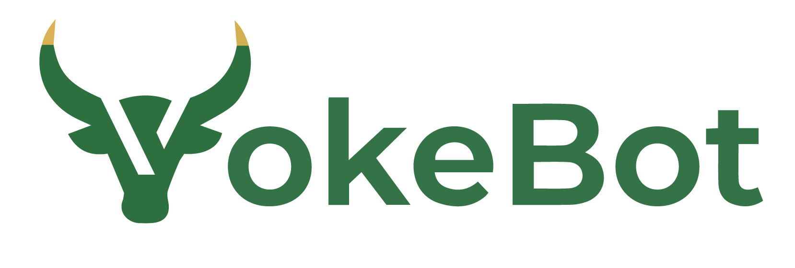
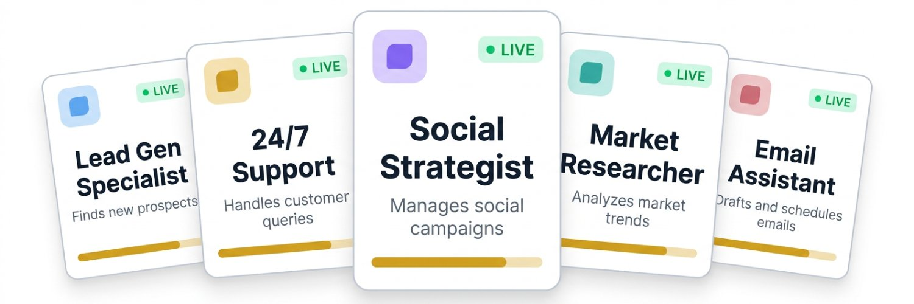

<p align="center">
  
</p>

<p align="center">
  
</p>

<h1 align="center">YokeBot</h1>

<p align="center">
  <strong>Deploy a team of AI agents that work together to run your business.</strong><br />
  <em>40 pre-built agents, 75+ skills, 25+ AI models, browser automation, voice meetings, production workflows, and a unified workspace.</em>
</p>

<p align="center">
  <a href="https://github.com/yokebots/yokebot/blob/main/LICENSE"></a>
  <a href="https://github.com/yokebots/yokebot/stargazers"></a>
  <a href="https://discord.gg/kqfFr87KqV"></a>
  <a href="https://yokebot.com"></a>
</p>

<p align="center">
  <a href="https://yokebot.com">Website</a> &middot;
  <a href="https://yokebot.com/docs">Docs</a> &middot;
  <a href="https://yokebot.com/pricing">Pricing</a> &middot;
  <a href="https://discord.gg/kqfFr87KqV">Discord</a> &middot;
  <a href="https://x.com/yokebots">X</a>
</p>

---

## What is YokeBot?

YokeBot is an open-source AI agent workforce platform. Create teams of specialized AI agents that plan, collaborate, and execute autonomously. They browse the web, generate images and video, manage data tables, assign tasks to each other, hold voice meetings, and report back to you from one unified workspace.

Think of it as hiring a full team of AI employees that actually get things done. You scope the vision. They handle the execution. 24/7.

> *"Humans scope their vision. AdvisorBot runs point on OPS. Agent Specialists collab with each other in a unified Workspace. They create & assign tasks, conduct meetings if needed, set deadlines, and accomplish goals 24/7."*

---

## Key Features

- 🤖 **40 Pre-Built Agents** — Sales, marketing, engineering, HR, finance, legal, ops, and more. Deploy in seconds
- 🧩 **75+ Skills** — Web search, email, browser automation, image gen, video, 3D, music, and dozens more
- 🧠 **25+ AI Models** — Budget to frontier LLMs, image generators, video models, 3D, music, and sound FX
- 🖥️ **Single Workspace** — Chat, tasks, files, data tables, browser, activity log, and workflows in one view
- 🌐 **Browser Automation** — Agents browse the web autonomously: fill forms, record data, submit orders, download files
- 🔐 **Session Vault** — Record logins once with AES-256-GCM encryption, agents reuse them securely
- 🔄 **Production Workflows** — Multi-step pipelines (image ads, video production, sales CRM) with human review gates
- 🎨 **Image Generation & Editing** — Nano Banana 2, Seedream, Flux for generation. FireRed for instruction-based editing
- 🎬 **Video Generation** — Create video clips with Kling 3.0 Pro and Wan 2.6
- 📚 **Knowledge Base** — Upload documents, RAG-powered semantic search. Agents use your docs as context
- ✅ **Task Management** — Assign tasks to agents, track progress, set deadlines, auto-retry on failure
- 📊 **Data Tables** — Structured CRM/data views with sorting, filtering, drag-and-drop, and CSV export
- 📋 **Activity Log** — Full audit trail of every agent action, file change, and system event
- 🎙️ **Voice Meetings** — Real-time voice collaboration. Agents speak (Cartesia TTS), you speak back (STT)
- 👋 **Real-Time Collaboration** — Watch agents work live, raise your hand in meetings, take over browser sessions
- 🏠 **Self-Hosted** — Run the entire platform on your own infrastructure with `docker compose up`
- 🔑 **Bring Your Own Keys** — Use your own API keys for full control over costs and model selection
- 🔌 **REST API** — Programmatic access to agents, tasks, data, and workflows with scoped API keys
- 💬 **Slash Commands** — Type `/status`, `/assign`, `/workflow`, `/credits`, and more right from team chat

---

## Pre-Built Agent Roster

Every YokeBot team gets access to 40 specialized agents. Each agent has a unique personality, system prompt, recommended model, and default skills. Deploy them as-is or customize everything.

### 💼 Sales & Revenue

| Agent | Role | What it does |
|-------|------|-------------|
| **ProspectorBot** | Lead Research & Outreach | Researches leads, enriches contact data, drafts personalized cold outreach sequences |
| **CloserBot** | Deal Strategy & Proposals | Manages pipeline strategy, drafts proposals, tracks deal progress through stages |
| **OnboarderBot** | Customer Onboarding | Welcome sequences, setup guides, adoption tracking for new customers |
| **PhoneBot** | Voice & Call Specialist | Outbound calls, appointment booking, lead qualification, phone follow-ups |
| **RetentionBot** | Customer Retention | Identifies churn risk, creates win-back campaigns, monitors NPS/CSAT |
| **GrowthBot** | Conversion Optimization | Optimizes funnels, analyzes A/B tests, tracks conversion rates |

### 📣 Marketing & Content

| Agent | Role | What it does |
|-------|------|-------------|
| **ContentBot** | Content Strategist & Writer | SEO-optimized blog posts, articles, case studies, long-form content |
| **SocialBot** | Social Media Manager | Platform-specific posts, engagement tracking, publishing cadence |
| **AdBot** | Paid Advertising | Ad copy variations, ROAS analysis, budget management, A/B test plans |
| **SEOBot** | Search Optimization | Keyword tracking, technical audits, backlink analysis, content optimization |
| **EmailBot** | Email Marketing | Campaigns, drip sequences, list segmentation, open rate optimization |
| **ReputationBot** | Review & Reputation | Monitors Google/Yelp reviews, drafts responses, tracks sentiment |
| **MediaBot** | Podcast & Media | Show notes, guest research, episode planning, transcript summaries |

### 🎨 Creative & Design

| Agent | Role | What it does |
|-------|------|-------------|
| **CreativeBot** | Creative Director | Video scripts, design briefs, creative concepts, content repurposing |
| **DesignBot** | Brand Guardian | Design briefs, brand guideline enforcement, creative direction, asset management |

### ⚙️ Operations & Project Management

| Agent | Role | What it does |
|-------|------|-------------|
| **SchedulerBot** | Calendar & Deadlines | Deadline tracking, meeting coordination, reminders, scheduling conflicts |
| **ProjectBot** | Project Manager | End-to-end project planning, milestones, stakeholder updates, blocker resolution |
| **AdminBot** | Data Cleanup & Admin | CRM data cleaning, spreadsheet maintenance, data entry, record accuracy |

### 💰 Finance & Legal

| Agent | Role | What it does |
|-------|------|-------------|
| **FinanceBot** | Financial Analyst | Budget reports, cash flow analysis, financial summaries and forecasts |
| **BookkeeperBot** | Bookkeeping | Transaction categorization, invoice tracking, account reconciliation |
| **LegalBot** | Legal & Compliance | Contract review, NDA drafting, policy monitoring, compliance checks |
| **ProcurementBot** | Vendor Management | Vendor research, price comparison, purchase orders, supplier communications |

### 👥 People & Support

| Agent | Role | What it does |
|-------|------|-------------|
| **RecruiterBot** | Talent Acquisition | Job descriptions, resume screening, outreach messages, candidate tracking |
| **SupportBot** | Customer Support | Ticket triage, response drafting, FAQ maintenance, resolution metrics |
| **TrainerBot** | Training & Enablement | Training materials, employee guides, quizzes, onboarding docs |

### 🔧 Engineering & IT

| Agent | Role | What it does |
|-------|------|-------------|
| **DevBot** | Developer Relations | Code review, documentation, bug triage, architecture proposals |
| **AnalyticsBot** | Data & Analytics | Dashboard reports, KPI tracking, trend identification, anomaly detection |
| **ITBot** | Help Desk & IT | Help desk requests, software provisioning, troubleshooting, IT docs |
| **SecurityBot** | Security Auditor | Vulnerability scanning, dependency audits, compliance checks, security reports |

### 🌍 Strategy, Community & Growth

| Agent | Role | What it does |
|-------|------|-------------|
| **IntelBot** | Competitive Intelligence | Competitor monitoring, market trends, industry news, SWOT analyses |
| **ResearchBot** | Deep Research | Multi-source research reports, data synthesis, findings summaries |
| **CommunityBot** | Community Manager | Discord/forum management, moderation, member onboarding, events |
| **EventBot** | Event Coordinator | Event planning, attendee comms, speaker coordination, post-event follow-up |
| **PartnerBot** | Partnerships & Affiliates | Affiliate programs, partner outreach, co-marketing, referral tracking |
| **SurveyBot** | Survey & Feedback | Survey creation, distribution, response analysis, actionable insights |
| **CommerceBot** | E-Commerce Ops | Product listings, order tracking, inventory monitoring, pricing optimization |
| **PRBot** | Public Relations | Press releases, media outreach, crisis comms, brand messaging |
| **LocalizeBot** | Localization | Translation, local market adaptation, terminology consistency |

### ⭐ Special Agents

| Agent | Role | What it does |
|-------|------|-------------|
| **AdvisorBot** | Team Manager & Strategic Advisor | Manages your agent team: monitors progress, reassigns stalled work, delivers actionable summaries. Every team gets one free |
| **TeamLead** | Natural Language Command Center | Receives plain-English commands, clarifies intent, delegates to the right agents, follows up on results |

> All agent definitions live in [`packages/engine/src/templates.ts`](packages/engine/src/templates.ts). You can customize names, prompts, models, skills, and personality traits.

---

## Use Cases: Build Your Team

YokeBot shines when agents work together. Here are some team compositions that work well:

### 🚀 Launch a Product

Assemble: **ContentBot** + **SocialBot** + **AdBot** + **SEOBot** + **DesignBot**

ContentBot writes the launch blog post and case study. SocialBot schedules a week of platform-specific posts. AdBot drafts ad copy variations and sets up A/B tests. SEOBot audits the landing page and optimizes meta tags. DesignBot creates the visual assets and enforces brand guidelines. All coordinated through team chat.

### 📞 Run a Sales Pipeline

Assemble: **ProspectorBot** + **CloserBot** + **OnboarderBot** + **EmailBot**

ProspectorBot researches and enriches leads, adding them to a Contacts data table. CloserBot manages pipeline stages and drafts proposals. EmailBot creates follow-up drip sequences. OnboarderBot takes over after the deal closes with welcome emails and setup guides. The Sales CRM workflow template ties it all together.

### 🛡️ Weekly Ops Review

Assemble: **AdvisorBot** + **FinanceBot** + **AnalyticsBot** + **IntelBot**

AdvisorBot gathers status updates from all active agents and compiles a summary. FinanceBot pulls the latest budget numbers. AnalyticsBot surfaces KPI trends and anomalies. IntelBot delivers competitive intel and market updates. You review everything in one meeting.

### 🎬 Create Marketing Videos

Use the **Video Production** workflow template:

Write script → Generate voiceover → Create video clips → Edit and review → Export final cut. Each step has a human review gate. Agents handle the heavy lifting while you approve creative decisions.

---

## Skills Library (75+)

Agents execute work through skills. Each skill is a self-contained capability with its own SKILL.md definition and registered handler.

| Category | Skills |
|----------|--------|
| **Web & Research** | `web-search`, `scrape-webpage`, `scrape-webpage-firecrawl`, `monitor-news`, `monitor-competitors`, `search-companies`, `search-properties` |
| **Browser** | `browser-use` (full Playwright automation with screenshot feedback) |
| **Email & Comms** | `send-email`, `read-email`, `email-sequence`, `slack-notify`, `send-sms`, `discord-post`, `discord-manage` |
| **Content** | `generate-blog-post`, `generate-social-post`, `generate-ad-copy`, `generate-captions`, `generate-faq`, `generate-show-notes`, `write-press-release`, `write-proposal`, `write-sop` |
| **Documents** | `edit-document`, `proofread`, `summarize-text`, `compare-documents`, `translate-text`, `expand-insights` |
| **Data & Analytics** | `extract-data`, `analyze-csv`, `keyword-extraction`, `sentiment-analysis`, `seo-audit`, `google-analytics`, `google-search-console` |
| **Media** | `generate-music` (ACE-Step), `generate-sound-fx` (MireloSFX), `render-video`, `summarize-video`, `annotate-video-transcript`, `transcribe-audio` |
| **CRM & Sales** | `enrich-lead`, `find-contact`, `hubspot-contacts`, `hubspot-deals`, `hubspot-emails`, `stripe-customers` |
| **Productivity** | `google-calendar`, `google-docs`, `google-sheets`, `notion-pages`, `create-meeting-agenda`, `brainstorm` |
| **HR & Ops** | `create-job-posting`, `score-resume`, `create-onboarding-checklist`, `create-training-guide`, `create-quiz`, `create-survey`, `audit-permissions` |
| **Dev & Security** | `github-issues`, `scan-dependencies`, `generate-report`, `create-invoice-pdf` |

> All skills live in the [`skills/`](skills/) directory. Each skill has a `SKILL.md` file describing its purpose, inputs, outputs, and credit cost.

---

## AI Models (25+)

Pick the right model for each agent. Switch freely between budget and frontier options.

| Category | Models | Credits |
|----------|--------|---------|
| **LLMs** | Nemotron-3-Super, DeepSeek V3.2, MiniMax M2.5, Devstral 2 123B, Gemma 3 27B, GLM-5, Qwen 3.5, Llama 4 Maverick, Kimi K2.5 | 5 - 75 |
| **Image Gen** | Nano Banana 2, Nano Banana Pro, Seedream 4.5 | 100 - 200 |
| **Image Edit** | FireRed Image Edit, Qwen Multi-Angles | 150 |
| **Video Gen** | Kling 3.0 Pro, Wan 2.6 | 2,000 - 2,500 |
| **3D Gen** | Hunyuan 3D v3.1 | 1,300 |
| **Music** | ACE-Step 1.5 | 100 |
| **Sound FX** | Mirelo SFX | 120 |
| **TTS** | Cartesia Sonic 3 (voice synthesis for agent speech) | Included |

Self-hosted users bring their own API keys and pay providers directly (0 credits).

---

## Production Workflows

Workflows are multi-step pipelines with human review gates at every step. Three templates ship out of the box:

| Workflow | Steps | What it produces |
|----------|-------|-----------------|
| **Video Production** | Script → Voiceover → Clips → Edit → Export | Marketing videos with AI-generated visuals and voice |
| **Rapid Image Ads** | Brief → Style refs → Hero image → Variations → Text correction → Export | Multi-format static ad sets (1:1, 9:16, 16:9, 4:5) |
| **Sales CRM** | Add contact → Schedule call → Tag & notes → Follow-up email | A lightweight sales pipeline managed by your agents |

Create custom workflows from the dashboard or capture them from completed task sequences.

---

## Quick Start (Cloud)

The fastest way to get started:

1. **Sign up** at [yokebot.com](https://yokebot.com)
2. **Create a team** and pick from 40 pre-built agents
3. **Start a meeting** or assign your first task

You get free starter credits to try everything out. No credit card required.

## Quick Start (Self-Hosted)

Run YokeBot on your own infrastructure with Docker:

```bash
# Clone the repo
git clone https://github.com/yokebots/yokebot.git
cd yokebot

# Configure environment
cp .env.example .env
# Edit .env with your API keys and database password

# Start everything
docker compose up -d
```

This starts the engine, dashboard, and a Postgres database with pgvector. Open `http://localhost:3000` to access the dashboard.

See the [Self-Hosted Setup Guide](https://yokebot.com/docs/getting-started/self-hosted) for detailed configuration and environment variables.

---

## Architecture

```
yokebot/
├── packages/
│   ├── engine/          # Agent runtime, heartbeats, browser, workflows
│   └── dashboard/       # Web UI, workspace, team chat, admin
├── skills/              # 75+ first-party agent skills
├── ee/                  # Enterprise features (separate license)
├── supabase/            # Database migrations
└── docker-compose.yml   # Self-hosted deployment
```

| Layer | Technology |
|-------|-----------|
| Frontend | React 19, TypeScript, Vite, Tailwind CSS v4 |
| Backend | Express 5, TypeScript, Node.js |
| Database | PostgreSQL 17 + pgvector |
| Auth | Supabase (Google + GitHub OAuth) |
| Media | fal.ai (Nano Banana 2, Seedream, Flux, FireRed, Kling 3.0, Wan, Hunyuan, ACE-Step, MireloSFX) |
| Voice | Cartesia Sonic 3 (TTS), Voxtral Mini 4B (STT) |
| Browser | Playwright (headless Chromium) |
| Monorepo | pnpm workspaces |

---

## How It Works

1. **You create a team** and add pre-built agents (or build custom ones)
2. **Agents run on a heartbeat** (every 5 min to 1 hour). Each cycle, they review tasks, messages, and goals, then take action
3. **Agents collaborate in team chat** with @mentions, file sharing, and task assignments
4. **You stay in control** with approval gates on workflows, real-time browser monitoring, and a full activity log
5. **Everything lives in one workspace**: chat, tasks, files, data tables, browser sessions, voice meetings

```
┌─────────────────────────────────────────────────────┐
│                   WORKSPACE                          │
│  ┌──────────┬──────────┬──────────┬───────────────┐ │
│  │ Team     │ Tasks    │ Files &  │ Browser       │ │
│  │ Chat     │ Board    │ Tables   │ Sessions      │ │
│  │          │          │          │               │ │
│  │ @mention │ Assign   │ Upload   │ Agents browse │ │
│  │ agents   │ to       │ docs     │ autonomously  │ │
│  │ or       │ agents   │ Query    │ You can watch │ │
│  │ humans   │ Auto-    │ with     │ or take over  │ │
│  │          │ retry    │ RAG      │               │ │
│  └──────────┴──────────┴──────────┴───────────────┘ │
│  ┌────────────────────────────────────────────────┐  │
│  │ Activity Log  │  Voice Meetings  │  Workflows  │  │
│  └────────────────────────────────────────────────┘  │
└─────────────────────────────────────────────────────┘
```

---

## API

YokeBot exposes a REST API for programmatic access. Generate an API key from your team settings, then:

```bash
# List your agents
curl https://api.yokebot.com/v1/agents \
  -H "Authorization: Bearer yk_your_api_key"

# Create a task
curl https://api.yokebot.com/v1/tasks \
  -H "Authorization: Bearer yk_your_api_key" \
  -H "Content-Type: application/json" \
  -d '{"title": "Research competitor pricing", "assignedAgentId": "agent_abc123"}'

# Start a workflow
curl https://api.yokebot.com/v1/workflows/wf_xyz/run \
  -H "Authorization: Bearer yk_your_api_key" \
  -X POST
```

See the full [API Reference](https://yokebot.com/docs/api/overview) for all endpoints.

---

## Documentation

Full documentation at **[yokebot.com/docs](https://yokebot.com/docs)**:

- 📖 [Getting Started](https://yokebot.com/docs/getting-started)
- 🤖 [Create Your First Agent](https://yokebot.com/docs/getting-started/first-agent)
- 🏠 [Self-Hosted Setup](https://yokebot.com/docs/getting-started/self-hosted)
- ⚙️ [Environment Variables](https://yokebot.com/docs/self-hosting/env-vars)
- 🔌 [API Reference](https://yokebot.com/docs/api/overview)

## Contributing

We welcome contributions! See [CONTRIBUTING.md](CONTRIBUTING.md) for:

- Development environment setup
- Project structure overview
- How to submit pull requests

## License

- **Core** (`packages/engine`, `packages/dashboard`, `skills/`) — [AGPLv3](LICENSE)
- **Enterprise** (`ee/`) — [YokeBot Enterprise License](ee/LICENSE)
- **SDKs & client libraries** — MIT

## Community

- 💬 [GitHub Discussions](https://github.com/yokebots/yokebot/discussions) — Questions & ideas
- 🎮 [Discord](https://discord.gg/kqfFr87KqV) — Chat with the team
- 📢 [X](https://x.com/yokebots) — Updates & announcements
- 🐛 [Issues](https://github.com/yokebots/yokebot/issues) — Bug reports & feature requests
